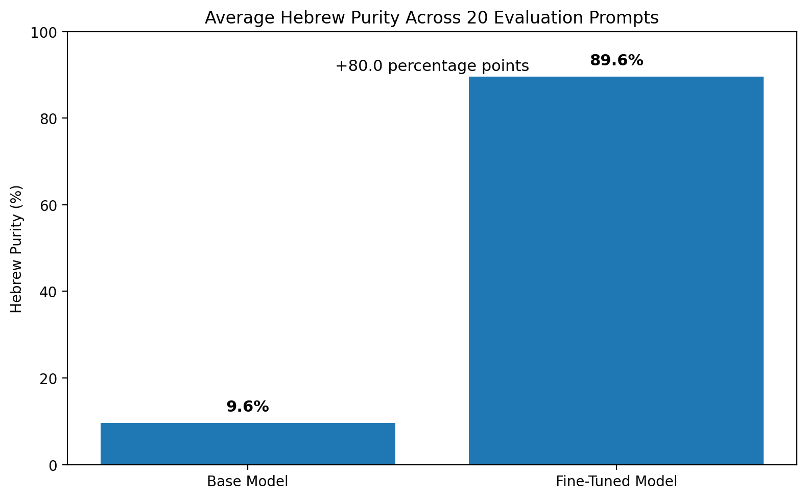

# Cross-Lingual LoRA Fine-Tuning: Teaching Qwen2.5 to Answer in Hebrew

Fine-tuning, decoding control, dataset engineering, and evaluation of `Qwen2.5-1.5B-Instruct` for English-to-Hebrew instruction following.

**`Qwen2.5` · `SFT` · `LoRA (PEFT)` · `Hugging Face Transformers` · `TRL` · `4-bit Quantization` · `Custom Constrained Decoding` · `Dataset Engineering` · `Ablation Experiments`**

## Overview

`Qwen2.5-1.5B-Instruct` answers English questions in English by default. This project fine-tunes it with **LoRA + SFT** on a self-generated dataset of 1,000 `English prompt → Hebrew answer` pairs, so the model learns to respond in Hebrew to English input — a controlled cross-lingual behavior-shift experiment, evaluated quantitatively and honestly, including where it fails.

**9.6% → 89.6% Hebrew output · 18/20 prompts ≥80% Hebrew · 1,000 training examples**

## Key Results

| Metric | Base model | Fine-tuned model |
|---|---|---|
| Average Hebrew purity across 20 unseen evaluation prompts | 9.6% | **89.6%** |
| Responses ≥ 80% Hebrew | 3 / 20 | **18 / 20** |
| Average content relevance (1–5) | ~4.4 | ~1.75 |



The language behavior shifted almost completely (+80pp Hebrew), but **not for free** — content relevance dropped sharply. This trade-off (language shift vs. catastrophic forgetting in a 1.5B model) is the central finding of the project, discussed in [Limitations](#limitations--lessons-learned) below.

## Examples

**Successful language adaptation** — *"Give a polite response to a job offer that you want to turn down."*
> Base model (English): avoided giving a direct answer.
> Fine-tuned (100% Hebrew, relevance 4/5): `תודה רבה על ההצעה! אני מרגישה שזו הזדמנות טובה יותר לשאת את המודעות שלי במשימה אחרת עכשיו.` — coherent, polite, and on-topic in Hebrew.

**Partial success** — *"Give a polite refusal to an invitation to a party."*
> Fine-tuned (82% Hebrew, relevance 3/5): mostly fluent, appropriately polite in tone, with minor English leakage ("Invitation," "patience") — Hebrew generation holds up, but not perfectly clean.

**Failure case** — *"Summarize the story of Cinderella in three sentences."*
> Fine-tuned (43% Hebrew, relevance 1/5): collapses back into English mid-sentence and hallucinates the plot ("a young actress from Rome...") — a clear case of factual/content failure.

## My Contribution

- Designed and generated the 1,000-example synthetic training dataset (English prompt → Hebrew answer), with deduplication checks against the evaluation set.
- Built the LoRA/SFT training pipeline (`train_qwen.py`) with configurable hyperparameters, and ran five iterative training experiments to diagnose and fix language drift.
- Implemented a custom `LogitsProcessor` for token-level constrained decoding, independent of the fine-tuning approach.
- Built the evaluation harness (`eval.py`) for Hebrew purity and foreign-language leakage, and compared base vs. fine-tuned outputs using an additional Gemini-assisted qualitative relevance evaluation.

## Training Pipeline

```
Synthetic Dataset (1,000 EN→HE pairs)
        │
        ▼
Qwen2.5-1.5B-Instruct  ──▶  LoRA / SFT (attention-only, 4-bit NF4)
        │
        ▼
Fine-tuned adapter  ──▶  Evaluation vs. base model (20 unseen prompts, multi-metric)
```

## Tech Stack

`Python` · `PyTorch` · `Hugging Face Transformers` · `PEFT` (LoRA) · `TRL` (`SFTTrainer`) · `bitsandbytes` (4-bit NF4) · `datasets`

## Dataset

- **1,000 examples**, chat-formatted (`system` / `user` / `assistant`), generated with LLM assistance and manually spot-checked for Hebrew quality.
- Fixed system prompt across all examples: *"You are a helpful assistant. Always respond in Hebrew only..."* — added to training data after early runs showed this was the single biggest lever for reducing language drift.
- **Zero overlap** with the 20 unseen evaluation prompts, verified by exact string matching.

## Fine-Tuning Configuration

| Parameter | Value |
|---|---|
| LoRA rank (r) | 16 |
| LoRA alpha | 32 |
| Target modules | `q_proj`, `k_proj`, `v_proj`, `o_proj` (attention only) |
| Epochs | 3 |
| Learning rate | 1e-4 (cosine schedule) |
| Quantization | 4-bit NF4 |

## Experiments / Ablations

Five training iterations were run before settling on the final configuration — logged and compared, not just the final result:

| Run | Config | Outcome |
|---|---|---|
| 1–2 | r=32, no system prompt in training | Outputs drifted into Chinese/Korean and other scripts |
| 3 | r=32, 10 epochs, system prompt added | Major jump in Hebrew consistency; still had sampling-related collapses |
| 4 | r=64, 15 epochs (targeting MLP + attention) | **Lowest training loss achieved, but factual coherence got worse** — the more aggressive configuration, including MLP targets, led to substantial overfitting and poorer held-out outputs |
| **Final** | r=16, 3 epochs, attention-only, conservative LR | Final selected configuration — deliberately more conservative to reduce catastrophic forgetting |

**Takeaway:** lower training loss did not correlate with a better model — the run with the best loss (Run 4) produced the most hallucinated outputs. Model selection therefore prioritized task-level behavior and held-out evaluation over training loss alone.

## Evaluation

Both the base model and the fine-tuned model were run on the **same 20 unseen evaluation prompts** (10 from the task spec + 10 additional), using identical decoding settings. Metrics computed per response:

- **Hebrew purity** — % of non-whitespace characters in the Hebrew Unicode block
- **Foreign leakage** — % of characters that are neither Hebrew, digits, nor punctuation
- **Qualitative relevance score (1–5, Gemini-assisted)** — does the response actually address the question

## Constrained Decoding

Before fine-tuning, Hebrew-only output was also tested purely at **decoding time**, with no weight updates: a custom Hugging Face `LogitsProcessor` masks the full vocabulary at every generation step, allowing only tokens that decode to Hebrew script, digits, punctuation, or structural special tokens (`-inf` on everything else pre-softmax). This is a separate, complementary approach to controlling model output language — useful context for why fine-tuning was chosen as the primary method: decoding-time constraints alone control token selection but don't fix content coherence.

## Limitations & Lessons Learned

- **Catastrophic forgetting**: fine-tuning successfully shifted the output language toward Hebrew, but failed to preserve the base model's factual and semantic performance.
- **Residual language leakage**: ~10% of fine-tuned output characters are still non-Hebrew, mostly English words for concepts (e.g. "deadline," "boiling") the model doesn't yet have solid Hebrew vocabulary for.
- **Model scale is a real constraint**: at 1.5B parameters, there's limited capacity to hold factual knowledge *and* switch output language simultaneously. A 7B+ base model would likely show less degradation under the same method, though this wasn't tested directly.
- **Loss ≠ quality**: the best-loss checkpoint was not the best-performing one — a reminder to always validate on task-relevant metrics, not just the training curve.

## Additional Analysis

Two supplementary studies are included in this repo but kept out of the main results above:

- **[`part1_architecture/`](./part1_architecture)** — comparative breakdown of architectural design choices (attention type, normalization, MoE, position encoding) across 10 open-weight LLMs, extracted from `config.json` + source-code inspection.
- **[`part2_tokenizers/`](./part2_tokenizers)** — tokenizer efficiency analysis (tokens-per-word) for English vs. Hebrew across the same 10 models.
- **[`part3_constrained_decoding/`](./part3_constrained_decoding)** — full code and outputs for the `LogitsProcessor`-based constrained decoding experiment described above.

## How to Run

```bash
pip install -r requirements.txt   # transformers, peft, trl, bitsandbytes, datasets

# Fine-tune (LoRA + SFT on Qwen2.5-1.5B-Instruct)
python part4_finetuning/train_qwen.py \
    --epochs 3 --lr 1e-4 --lora_r 16 \
    --output_dir ./qwen_hebrew_lora_best

# Evaluate base vs. fine-tuned model on the 20-prompt eval set
python part4_finetuning/eval.py
```

## Notes

Originally completed as a university assignment; this repository includes code, structured outputs, and a representative data sample — no model weights are included.
